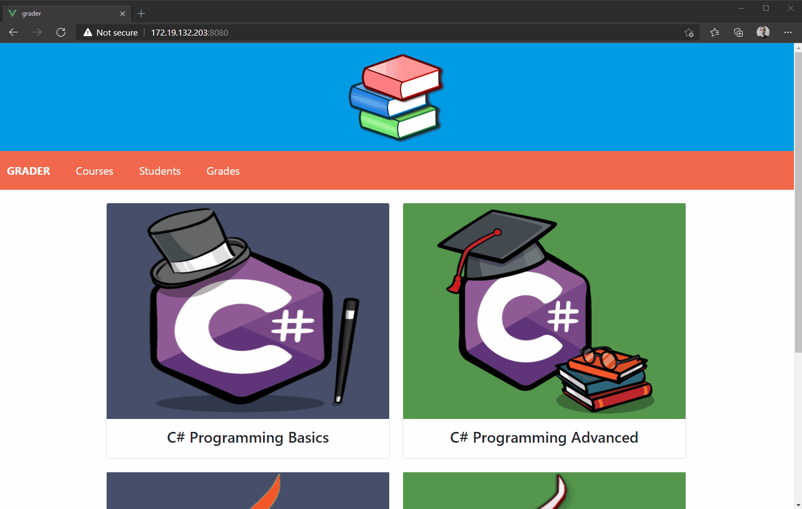

<!-- PROJECT LOGO -->
<br />
<p align="center">
  <a href="https://github.com/github_username/repo_name">
    
  </a>

  <h3 align="center">Grader</h3>

  <p align="center">
    Grader is a simple application that presents available courses and is used to display grades of the students.
    This is a simple proof of concept and all the similarities with the real-world agencies is coincidental.
    <br />
    <br />
    <a href="https://github.com/hasan-hasanov/GradeR/issues">Report Bug</a>
    ·
    <a href="https://github.com/hasan-hasanov/GradeR/issues">Request Feature</a>
  </p>
</p>


<!-- TABLE OF CONTENTS -->
  <summary><h2 style="display: inline-block">Table of Contents</h2></summary>
  <ol>
    <li><a href="#about-the-project">About The Project</a></li>
    <li><a href="#getting-started">Getting Started</a></li>
    <li><a href="#contributing">Contributing</a></li>
    <li><a href="#license">License</a></li>
    <li><a href="#contact">Contact</a></li>
  </ol>

<!-- ABOUT THE PROJECT -->
## About The Project



### Built With

#### Backend
* [ASP.NET Core](https://docs.microsoft.com/en-us/aspnet/core/whats-new/?view=aspnetcore-3.1)
* [Entity Framework Core 3.1](https://docs.microsoft.com/en-us/ef/core/)
* [SQL Server 2019](https://www.microsoft.com/en-us/sql-server/sql-server-2019)
* [MediatR](https://github.com/jbogard/MediatR)
* [Odata](https://www.odata.org/)
* [Docker](https://www.docker.com/)

#### Front-end
* [Vue.js 3.0](https://v3.vuejs.org/)
* [Vuex 4](https://vuex.vuejs.org/)
* [Bootstrap 5](https://getbootstrap.com/)
* [Nginx](https://www.nginx.com/)

<!-- GETTING STARTED -->
## Getting Started

To get a local copy up and running follow these simple steps.

### Docker Compose

Compatible with Docker version 17.09.0+. Ideal if you want to run the application.

```
docker-compose build
docker-compose up
```

### Installation

Clone the repo:
   ```sh
   git clone https://github.com/github_username/repo_name.git
   ```
   
#### Api

In order to build and run the Api you need:

#### Prerequisites

* Sql Server 2019
* .NET Core SDK 3.1

1. Set the connection string to the database in appSettings.Development.json the default is:

```json
  "ConnectionStrings": {
    "GradeR": "Data Source=.;Initial Catalog=GradeR;User Id=USER; Password=PASSWORD"
  }
```

2. Build and run:

```
dotnet GradeR.dll
```

3. Browse:

```
https://localhost:44338/hc
```
If everything is up and running, it should display **Healthy**

#### Front-end

In order to build and run the front-end application you need:

#### Prerequisites

* npm

1. Navigate to src/Front-End/grader/

2. Install npm packages

```
npm install
```

3. Start the project

```
npm run serve
```

4. Browse:

```
https://localhost:8080
```
If everything is up and running you'll see the application

<!-- CONTRIBUTING -->
## Contributing

Contributions are what make the open-source community such an amazing place to be learn, inspire, and create. Any contributions you make are **greatly appreciated**.

1. Fork the Project
2. Create your Feature Branch (`git checkout -b feature/AmazingFeature`)
3. Commit your Changes (`git commit -m 'Add some AmazingFeature'`)
4. Push to the Branch (`git push origin feature/AmazingFeature`)
5. Open a Pull Request


<!-- LICENSE -->
## License

Distributed under the MIT License. See `LICENSE` for more information.


<!-- CONTACT -->
## Contact

Hasan Hasanov - [@hmhasanov](https://twitter.com/hmhasanov)
Blog - https://hasan-hasanov.com/
